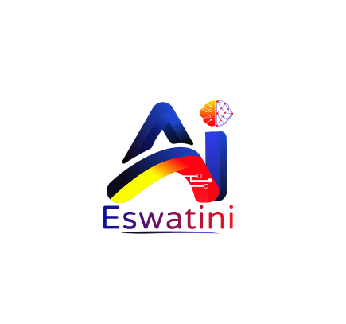

  

<h1 align="center">AI Eswatini</h1>

  The catalyst for machine learning research, structural development, and responsible AI adoption within the Kingdom of Eswatini. 
  We bridge global technical breakthroughs with localized, sovereign implementation.

  <a href="https://aieswatini.org/">Official Website</a> &bull;
  <a href="https://insights.aieswatini.org/">Research Insights</a> &bull;
  <a href="mailto:info@aieswatini.org">Get in Touch</a>

## Get Involved

Open communities are building impactful AI together — and we are no different. Whether you are an engineer, researcher, or domain expert, there is a place for you here.

- [Explore our active repositories](https://github.com/orgs/AI-Eswatini/repositories) and find a "good first issue" to contribute to
- [Read our Research Insights](https://insights.aieswatini.org/) for the latest work from our team
- [Submit a dataset](mailto:info@aieswatini.org) — clean, non-proprietary datasets addressing local infrastructure or environmental challenges are always welcome
- [Contact us for partnerships](mailto:info@aieswatini.org) — formal research collaborations, joint grants, and university chapter proposals
